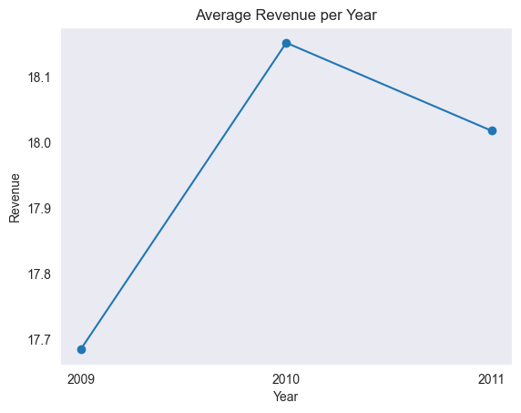
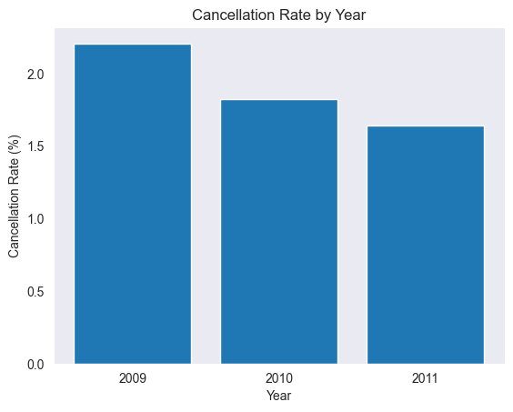

# Measuring the Performance of Online Retail Sales
this is one of my personal projects to practice my data analysis skills. click <a href="https://github.com/lanafuadi?tab=repositories">here</a> to see another project.

  
   
  Image by <a href="https://ekonomi.bisnis.com/read/20210808/12/1427409/pengamat-ungkap-alasan-pertumbuhan-ritel-online-tak-bertahan-lama">bisnis.com</a>

### Objective:
Imagine that you are working for an online retail company, and your customers are spread across various countries. You have been given data containing all the transactions that occurred from 2009 to 2011. Currently, you are asked to analyze the sales performance over the past 3 years.

### Attributes:
● Invoice     : A 6-digit invoice number that is uniquely assigned to each transaction. If this code starts with the letter 'C', it indicates a cancellation.
● StockCode   : Product (item) code. A 5-digit number that is uniquely assigned to each different product.
● Description : Product name.
● Quantity    : The quantity of each product per transaction.
● InvoiceDate : The date and time of the invoice, which is the day and time when the transaction was made.
● UnitPrice   : The unit price or price of the product per unit in sterling (£).
● CustomerID  : A unique 5-digit number assigned to each customer.
● Country     : The name of the country where the customer resides.

### Conclusion:
● In 2010, there was a significant increase in the number of transactions, indicating that the company's campaign was successful.
● In 2011, the number of transactions decreased, so further analysis is needed to prevent a decrease in the following year.
● The cancellation rate decreased every year.

  

  

